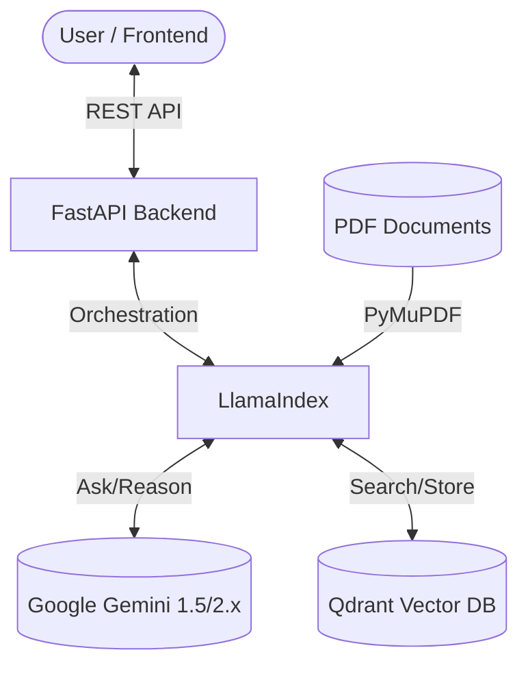

# 🚀 Advanced Vector Search & RAG (Retrieval-Augmented Generation)

[](https://www.python.org/)
[](https://nextjs.org/)
[](https://fastapi.tiangolo.com/)
[](https://opensource.org/licenses/MIT)

ระบบถาม-ตอบอัจฉริยะ (RAG) ที่เชื่อมต่อข้อมูลจากไฟล์ PDF เข้ากับพลังของ Google Gemini ผ่าน LlamaIndex และจัดเก็บข้อมูลในรูปแบบ Vector บน Qdrant Database

---

## 🌟 Key Features (คุณสมบัติเด่น)

- **📄 Smart Ingestion**: อัปโหลดและประมวลผลไฟล์ PDF อัตโนมัติด้วย PyMuPDF
- **🧠 Advanced Vector Search**: ค้นหาข้อมูลเชิงความหมาย (Semantic Search) ผ่าน Qdrant
- **💬 Contextual Chat**: ระบบตอบคำถามที่จำบริบทการสนทนาได้ (Long-term Memory)
- **⚡ Super Fast API**: ขับเคลื่อนด้วย FastAPI พร้อมรองรับ Production
- **🎨 Modern Frontend**: หน้าจอผู้ใช้งานสวยงามและตอบสนองเร็วด้วย Next.js 15

---

## 🏗️ Architecture (โครงสร้างระบบ)



---

## 🛠️ Tech Stack (เทคโนโลยีที่ใช้)

สำหรับรายละเอียดเชิงลึก สามารถอ่านได้ที่ [TECHSTACK.md](./TECHSTACK.md)

### Backend
- **Python 3.10+** & **FastAPI**
- **LlamaIndex**: ตัวขับเคลื่อนระบบ RAG
- **Qdrant**: ฐานข้อมูล Vector สำหรับจัดเก็บความรู้จากเอกสาร
- **Google Generative AI**: ใช้ Gemini เป็นสมองในการคิดและตอบคำถาม
- **HuggingFace Embedding**: `BAAI/bge-small-en-v1.5` สำหรับการแปลงข้อความเป็น Vector

### Frontend
- **Next.js 15 (App Router)**
- **TypeScript**
- **Tailwind CSS**
- **Lucide Icons**

---

## ⚙️ Get Started (การติดตั้งและใช้งาน)

### 1. เตรียม API Key
ตั้งค่า Google API Key ในไฟล์ `.env` หรือในโค้ดของคุณ:
```python
os.environ["GOOGLE_API_KEY"] = "YOUR_API_KEY_HERE"
```

### 2. รัน Backend (Python)
```bash
# ติดตั้ง dependencies
pip install -r requirements.txt

# สั่งรัน API
python api.py
```

### 3. รัน Frontend (Next.js)
```bash
cd frontend-rag

# ติดตั้ง dependencies
npm install

# รันโหมดพัฒนา
npm run dev
```

---

## 📁 Project Structure (โฟลเดอร์โครงการ)

- `api.py`: ไฟล์หลักสำหรับ Backend API
- `ingest.py`: สคริปต์สำหรับนำเข้าข้อมูล PDF เข้าฐานข้อมูล
- `data/`: โฟลเดอร์เก็บไฟล์ PDF
- `frontend-rag/`: โปรเจกต์ Next.js สำหรับหน้าจอผู้ใช้งาน
- `requirements.txt`: รายการไลบรารีที่จำเป็นสำหรับ Python

---

## 🤝 Contribution
ยินดีรับการร่วมพัฒนา (Pull Request) และการแจ้งปัญหา (Issue) เสมอครับ!

---

## 📜 License
โปรเจกต์นี้อยู่ภายใต้ใบอนุญาต **MIT License**